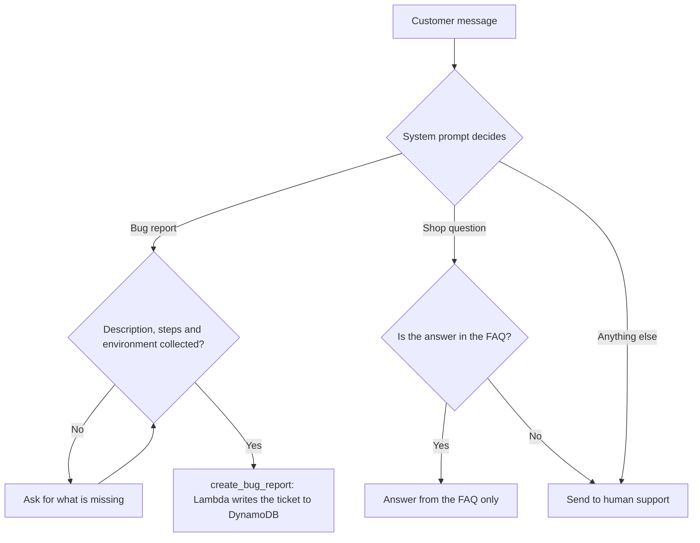
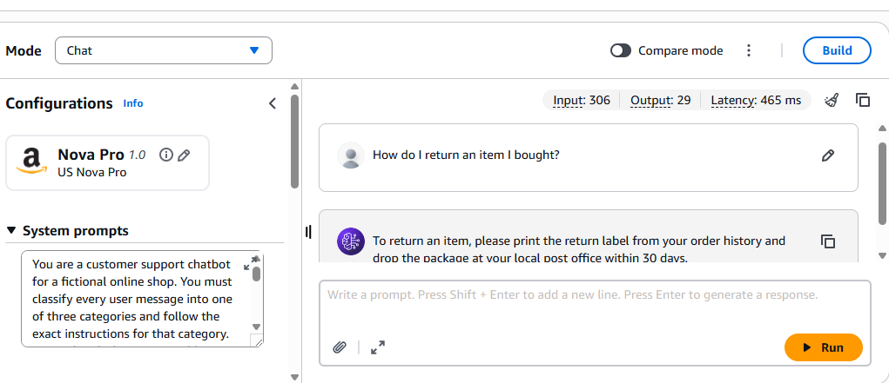
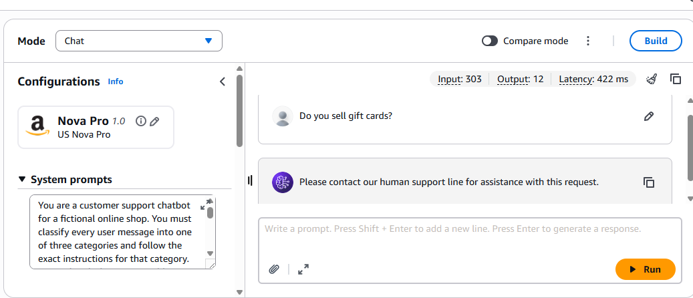
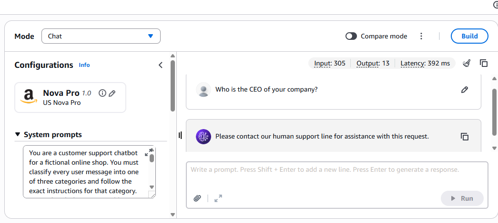
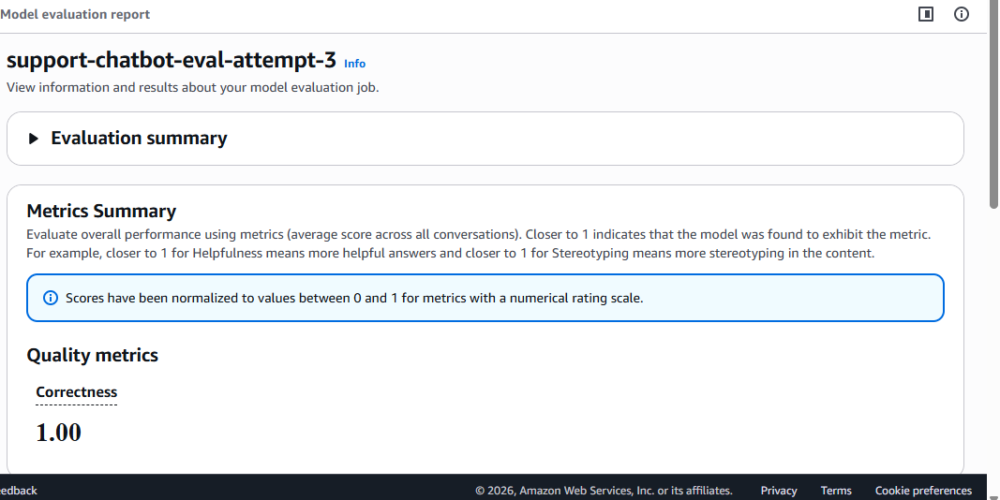

# A Support Bot That Knows When to Hand Off

A customer support chatbot for a made-up online shop, built on Amazon Bedrock AgentCore with Amazon Nova Pro. It was my project for the AWS Agentic Engineer nanodegree.

I wanted to see how far one system prompt could go as a router, with no workflow builder and no separate classifier. Every message lands in one of three places:



The rule I cared about most: if the bot doesn't have the answer, it says so with one fixed sentence and points to a human. It does not guess.

## See it work

**A question the FAQ covers**



**A shop question the FAQ does not cover.** Gift cards sound like a normal question, but they aren't in the FAQ, so the bot hands off instead of inventing a policy.



**Something unrelated to the shop**



Single runs in the Bedrock chat playground with the same system prompt: 306, 303 and 305 input tokens, 29, 12 and 13 output tokens, and 465, 422 and 392 ms. Read those as a rough feel for speed, not a benchmark.

## The part worth a look: two locks on bug tickets

A half-filled ticket is the easiest way for this bot to go wrong, so ticket creation has two guards.

1. **The prompt** forbids calling `create_bug_report` until the bot has a description, the steps to reproduce, and the environment. If any is missing, it asks. It must not invent details.
2. **The Lambda** behind AgentCore Gateway rejects empty fields and sends an error back telling the model to ask the customer. Models sometimes try to satisfy a required field with an empty string, and the code does not accept that.

With all three fields present, the Lambda saves the ticket to DynamoDB (UUID, status OPEN, timestamp) and returns the ID to the model.

## How I tested it

`harness-tests.json` has one case for each thing the bot must get right:

| Test | Prompt | Should |
|---|---|---|
| platform-covered | "How do I return an item I bought?" | Answer from the FAQ only |
| platform-uncovered | "Do you sell gift cards?" | Hand off to human support |
| other-request | "Who is the CEO of your company?" | Hand off to human support |
| bug-report | "The shopping cart page is completely broken and won't load." | Ask for environment and steps first |

I then ran the routing against a ground-truth JSONL dataset with Bedrock's automated evaluation and an LLM judge. The job `support-chatbot-eval-attempt-3` scored Correctness 1.00.



That number comes from a small test set that I wrote, so it tells me the prompt handles these cases. It does not tell me the bot would hold up with real customers.

## Honest limits

- Tickets go to a DynamoDB table, not to a real tracker like Jira.
- The AWS environment was temporary and has been torn down. The screenshots and the evaluation report are what remain of the cloud run.
- Routing rests on one prompt, and the exact handoff sentence depends on the model following it. Rerun the evaluation after any prompt edit.
- Not tested yet: mixed-intent messages, prompt-injection attempts, typos, and other languages.

## Run it

```bash
git clone https://github.com/anizzme/bedrock-agentcore-chatbot.git
cd bedrock-agentcore-chatbot
pip install -r requirements.txt
python chat.py
```

`chat.py` simulates the routing locally. The full AgentCore version needs your own AWS account, Bedrock model access, and the CloudFormation templates here (`deploy_test.sh`, `run_deploy.sh`). `cleanup.sh` and `cleanup_agentcore.py` remove what they create.

## What I'd build next

1. A larger test set made of messy messages: typos, mixed intent such as "there's a bug, and how long is shipping?", and attempts to override the prompt.
2. A real ticketing integration, with tests for failures like timeouts.
3. A log of every routing decision, so wrong routes can become new test cases.

## What's in here

`system_prompt.txt` holds the routing rules and `online_shop_faq.md` is the FAQ it answers from. `create_bug_report.py` is the Lambda behind the ticket tool. `create_harness.py` and `setup_gateway.py` set up AgentCore. `generate-eval-dataset.py`, `harness-tests.json` and `run_eval.sh` cover testing and evaluation. The `cloudformation-*.yaml` files describe the infrastructure, and `assets/` has the screenshots above.
